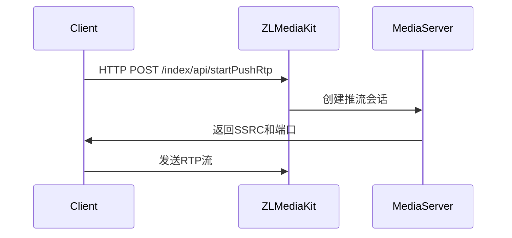

### HTTP 控制推流流程
ZLMediaKit 通过内置的 **WebAPI** 接口接受 HTTP 命令，典型推流控制流程如下：


### 常用 HTTP 控制命令示例

#### 1. **开始推流**
```bash
curl "http://127.0.0.1/index/api/startPushRtp?\
secret=035c73f7-bb6b-4889-a715-d9eb2d1925cc&\
vhost=__defaultVhost__&\
app=live&\
stream=test&\
dst_url=192.168.1.100&\
dst_port=10000&\
ssrc=123456"
```
**参数说明**：
- `secret`: API 鉴权密钥（需与配置文件一致）
- `vhost/app/stream`: 流标识符
- `dst_url`: 目标服务器IP
- `dst_port`: 目标端口
- `ssrc`: 自定义的SSRC值（可选）

#### 2. **停止推流**
```bash
curl "http://127.0.0.1/index/api/stopPushRtp?\
secret=035c73f7-bb6b-4889-a715-d9eb2d1925cc&\
vhost=__defaultVhost__&\
app=live&\
stream=test&\
ssrc=123456"
```

#### 3. **查询推流状态**
```bash
curl "http://127.0.0.1/index/api/listRtpSenders"
```

---

### 三、ZLMediaKit 的 HTTP 命令解析机制

#### 1. **WebAPI 注册流程（源码解析）**
```cpp
// WebApi.cpp 中注册API接口
void API::registerApi() {
    // 注册startPushRtp接口
    _api_map.emplace("startPushRtp", [](const Json::Value &req) {
        // 1. 参数校验
        CHECK_SECRET();
        CHECK_PARAM(vhost); CHECK_PARAM(app); CHECK_PARAM(stream);
        
        // 2. 创建RTP推流器
        auto push_rtp = createRtpPusher(req);
        
        // 3. 返回结果
        return Json::Value{
            {"ssrc", push_rtp->getSsrc()},
            {"port", push_rtp->getPort()}
        };
    });
}
```

#### 2. **请求处理关键步骤
1. **路由匹配**  
   - 通过 `HttpSession` 解析 URL 路径 (`/index/api/xxx`)
   - 在 `_api_map` 中查找对应处理函数

2. **参数提取**  
   - 从 URL Query 或 JSON Body 中获取参数
   - 自动类型转换（字符串→整型/布尔型）

3. **鉴权验证**  
   ```cpp
   #define CHECK_SECRET() \
       if (req["secret"].asString() != mINI::Instance()[kSecret]) \
           throw InvalidArgsException("Invalid secret");
   ```

4. **业务执行**  
   - 调用 `MediaManager` 操作媒体流
   - 通过 `RtpSender` 管理RTP推流

5. **响应生成**  
   - 统一封装为 JSON 格式
   - 错误码标准化（200=成功, 其他=失败）

---
安装api接口
* installWebApi()
  * addHttpListener()
  * api_regist
    * s_map_api.emplace(api_path, toApi(func));
