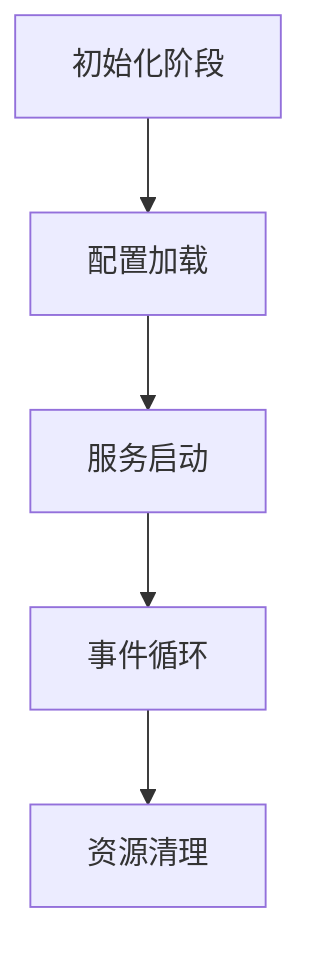

以下是针对 ZLMediaKit 的 `main` 函数的深度分析，结合其源码结构和设计思想进行系统性解读：

---

### 一、代码结构概览
ZLMediaKit 的 `main` 函数（位于 `main.cc`）采用分层设计，主要包含以下模块：


---

### 二、关键流程解析

#### 1. **初始化阶段**
```cpp
// 日志系统初始化（支持控制台+文件输出）
Logger::Instance().add(std::make_shared<ConsoleChannel>());
Logger::Instance().add(std::make_shared<FileChannel>());

// 命令行参数解析（支持11种参数）
CMD_main cmd_main;
cmd_main(argc, argv);
```
- **日志设计亮点**：
  - 异步日志写入（`AsyncLogWriter`）
  - 日志切片管理（按天/大小滚动）
  - 多级别过滤（LTrace~LError）

#### 2. **配置加载**
```cpp
// 加载INI配置文件
loadIniConfig(g_ini_file.data());

// 动态配置示例（RTSP端口范围）
mINI::Instance()[Rtsp::kPort] = 554; 
mINI::Instance()[Rtsp::kSSLPort] = 332;
```
- **配置热更新**：
  - 通过 `SIGHUP` 信号触发重载
  - 证书文件动态加载（`g_reload_certificates`）

#### 3. **服务启动**
```cpp
// 线程池初始化（CPU亲和性支持）
EventPollerPool::setPoolSize(threads);
WorkThreadPool::setPoolSize(threads);

// 协议服务器启动（模板方法模式）
rtspSrv->start<RtspSession>(554);
rtmpSrv->start<RtmpSession>(1935);
```
- **关键服务**：
  | 服务类型       | 默认端口 | 实现类               |
  |----------------|----------|----------------------|
  | RTSP           | 554      | `RtspSession`        |
  | RTMP           | 1935     | `RtmpSession`        |
  | WebRTC         | 8000     | `WebRtcSession`      |
  | SRT            | 9000     | `SrtSession`         |

#### 4. **事件循环**
```cpp
// 主事件循环（基于epoll）
EventPollerPool::Instance().runLoop();

// 信号处理（优雅退出）
signal(SIGINT, [](int) { sem.post(); });
sem.wait();
```
- **性能优化**：
  - 每个线程独立 `EventPoller`
  - 无锁任务队列

---
