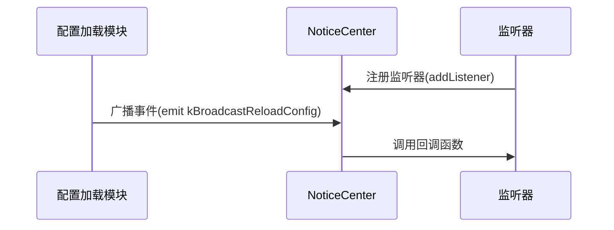

std::make_shared 是 C++11 引入的一个智能指针工厂函数，用于高效地创建和管理 std::shared_ptr
### 与 `new` 的对比

| 特性                | `std::make_shared`       | 直接 `new` + `shared_ptr` |
|---------------------|--------------------------|---------------------------|
| 内存分配次数        | 1次                      | 2次                       |
| 异常安全            | ✅                        | ❌（除非严格分离语句）      |

---
```
NoticeCenter::Instance().addListener(ReloadConfigTag,Broadcast::kBroadcastReloadConfig,[&](BroadcastReloadConfigArgs){...}
```
这段代码展示了一个典型的事件监听/广播系统的使用方式，属于观察者模式的一种实现。
### 1. 代码结构分解
```cpp
NoticeCenter::Instance().addListener(
    ReloadConfigTag,                          // 事件标签/频道
    Broadcast::kBroadcastReloadConfig,        // 事件类型/ID 
    [&](BroadcastReloadConfigArgs){...}       // Lambda回调函数
);
```
### 2. 核心组件解析

#### (1) `NoticeCenter::Instance()`
- 这是一个单例模式的访问方式
- `NoticeCenter` 是中心化的消息通知中心
- `Instance()` 获取全局唯一的通知中心实例

#### (2) `addListener` 方法
参数说明：
| 参数 | 类型 | 作用 |
|------|------|------|
| `ReloadConfigTag` | 标签类型 | 用于分类监听器的标签 |
| `Broadcast::kBroadcastReloadConfig` | 事件枚举值 | 具体要监听的事件类型 |
| Lambda 表达式 | 回调函数 | 事件触发时执行的逻辑 |

#### (3) `[&](BroadcastReloadConfigArgs){...}`
- `[&]`：Lambda捕获列表，`&`表示以引用方式捕获所有外部变量
- `BroadcastReloadConfigArgs`：事件参数类型
- `{...}`：事件触发时执行的具体逻辑

### 3. 典型工作流程


