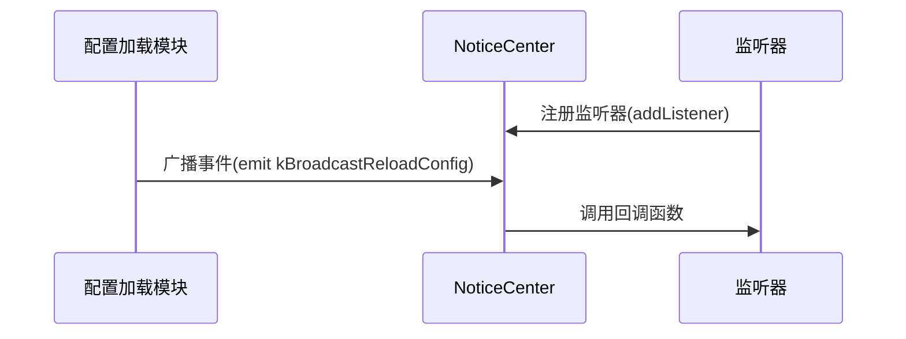
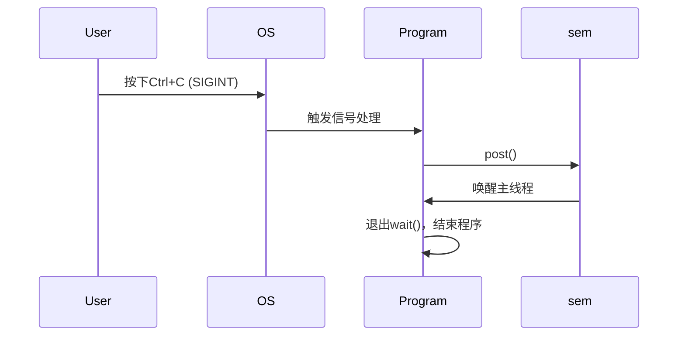
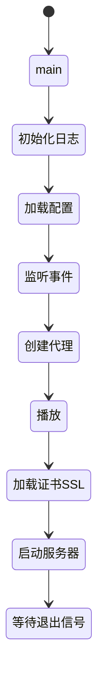

std::make_shared 是 C++11 引入的一个智能指针工厂函数，用于高效地创建和管理 std::shared_ptr
### 与 `new` 的对比

| 特性                | `std::make_shared`       | 直接 `new` + `shared_ptr` |
|---------------------|--------------------------|---------------------------|
| 内存分配次数        | 1次                      | 2次                       |
| 异常安全            | ✅                        | ❌（除非严格分离语句）      |
****
---
```
NoticeCenter::Instance().addListener(ReloadConfigTag,Broadcast::kBroadcastReloadConfig,[&](BroadcastReloadConfigArgs){...}
```
这段代码展示了一个典型的事件监听/广播系统的使用方式，属于观察者模式的一种实现。
### 1. 代码结构分解
```cpp
NoticeCenter::Instance().addListener(
    ReloadConfigTag,                          // 事件标签/频道
    Broadcast::kBroadcastReloadConfig,        // 事件类型/ID 
    [&](BroadcastReloadConfigArgs){...}       // Lambda回调函数
);
```
### 2. 核心组件解析

#### (1) `NoticeCenter::Instance()`
- 这是一个单例模式的访问方式
- `NoticeCenter` 是中心化的消息通知中心
- `Instance()` 获取全局唯一的通知中心实例

#### (2) `addListener` 方法
参数说明：
| 参数 | 类型 | 作用 |
|------|------|------|
| `ReloadConfigTag` | 标签类型 | 用于分类监听器的标签 |
| `Broadcast::kBroadcastReloadConfig` | 事件枚举值 | 具体要监听的事件类型 |
| Lambda 表达式 | 回调函数 | 事件触发时执行的逻辑 |

#### (3) `[&](BroadcastReloadConfigArgs){...}`
- `[&]`：Lambda捕获列表，`&`表示以引用方式捕获所有外部变量
- `BroadcastReloadConfigArgs`：事件参数类型
- `{...}`：事件触发时执行的具体逻辑

### 3. 典型工作流程



---

```
static semaphore sem;                          // 1. 静态信号量
signal(SIGINT, [](int) { sem.post(); });       // 2. 注册SIGINT信号处理
signal(SIGHUP, [](int) { loadIniConfig(); });  // 3. 注册SIGHUP信号处理
sem.wait();    
```
这段代码实现了一个**基于信号量(semaphore)的优雅退出机制**和**信号处理系统**，主要用于控制程序的执行流程和响应系统信号。

### **2. 核心组件解析**
#### **(1) `signal(SIGINT, handler)`**
- **功能**：注册信号处理函数
- **SIGINT**：终端中断信号（如Ctrl+C）
  - Lambda回调 `[](int) { sem.post(); }` 会触发信号量释放
- **SIGHUP**：终端挂起/配置文件重载信号
  - 直接调用 `loadIniConfig()` 重新加载配置

#### **(2) `sem.wait()`**
- **行为**：阻塞主线程，直到信号量被释放（`sem.post()`）
- **效果**：实现程序持久运行，直到收到退出信号

### **3. 工作流程**


---

```
    static mutex s_mtxFlvRecorder;
    lock_guard<mutex> lck(s_mtxFlvRecorder);
    s_mapFlvRecorder.clear();
```
这段代码是多线程编程的经典范式，通过lock_guard确保容器操作的安全性。
采用RAII（资源获取即初始化）的风格管理锁，构造时自动加锁，析构时自动解锁。

---



---

# initEventListener()
```
void initEventListener() {
    static onceToken s_token([]() {
    }
}    
```
**为什么用一个函数去包裹另一个匿名函数？**
onceToken是一个类，它的构造函数需要接收一个std::function
匿名函数包裹后，所有监听器共享同一作用域，可访问相同的局部变量